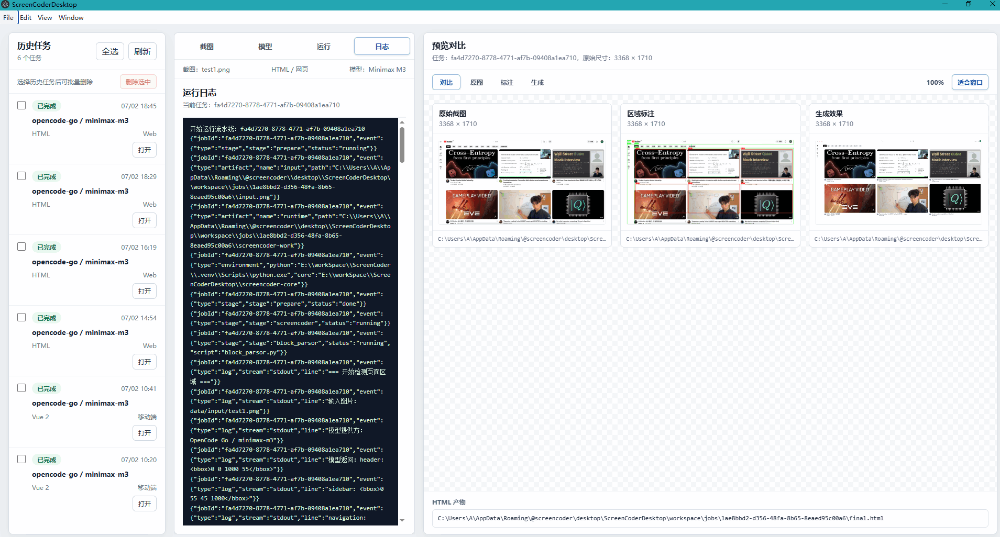

# ScreenCoderDesktop

ScreenCoderDesktop 是一个 Electron 桌面端项目，用于把 [leigest519/ScreenCoder](https://github.com/leigest519/ScreenCoder) 的截图转代码流水线产品化。

当前仓库阶段：生产化接入版。仓库包含 Electron 桌面端、真实 ScreenCoder Python Worker 适配器、SQLite 历史记录、提供商/模型配置、连接测试、实时日志、对比预览、HTML/Vue/React 目标框架导出和移动端布局修复。

## 运行截图



## 当前能力

- 支持拖拽或选择上传 `png`、`jpg`、`jpeg`、`webp` 截图。
- 支持分别配置大模型提供商和模型，模型配置可以选择已保存的提供商。
- API Key 使用 Electron `safeStorage` 加密保存到本机。
- 支持测试模型连接。
- 支持运行真实 ScreenCoder 完整流水线，不使用模拟流程。
- 支持目标框架：HTML、Vue 2、Vue 3、React。
- 支持页面类型：网页、移动端、自定义。
- 支持分阶段实时日志、心跳日志和产物路径记录。
- 支持右侧对比预览：原始截图、区域标注图、生成结果、源码产物。
- 支持 `100%` 原始尺寸查看和“适合窗口”查看。
- 支持历史任务打开、刷新、全选和批量删除；删除历史任务时会同步清理对应产物目录。
- 移动端任务会注入移动端生成约束，并对常见的全宽区域坐标截断问题做防御性修复。

## 和原 ScreenCoder 的关系

本项目没有重写 ScreenCoder 核心算法，而是在桌面端外壳中集成并编排原始流水线。运行时会把 `screencoder-core/` 复制到每个任务目录下的独立工作区，再按顺序执行：

1. `block_parsor.py`：识别页面主要区域。
2. `html_generator.py`：生成带占位图的初始 HTML。
3. `image_box_detection.py`：从 HTML 中回读占位图位置，并生成标注图。
4. `UIED/run_single.py`：执行 UI 元素检测。
5. `mapping.py`：建立截图元素和 HTML 占位区域映射。
6. `image_replacer.py`：替换占位图并输出最终 HTML。

桌面端额外提供模型配置、任务历史、日志、预览、安全读写、源码导出和移动端适配修正。

## 产物结构

每次运行会在应用工作区创建一个任务目录。常见产物如下：

```text
jobs/{任务目录}/
  input.png                                  # 桌面端复制的输入截图
  final.html                                 # 最终 HTML 产物
  ScreenCoderPage.vue                        # Vue 2 / Vue 3 目标框架产物
  ScreenCoderPage.tsx                        # React 目标框架产物
  cropped_images/                            # 替换后的局部图片资源
  screencoder-work/                          # 本次运行的 ScreenCoder 独立工作区
    data/input/test1.png                     # ScreenCoder 输入图
    data/output/test1_layout.html            # 初始 HTML
    data/output/test1_layout_final.html      # ScreenCoder 最终 HTML
    data/tmp/test1_bboxes.json               # 区域和占位图坐标
    data/tmp/debug_gray_bboxes_test1.png     # 右侧“标注”预览使用的区域标注图
```

右侧“预览对比”面板会优先读取：

- 原图：任务记录中的 `inputPath`。
- 标注：`screencoder-work/data/tmp/debug_gray_bboxes_test1.png`。
- 生成：`final.html`。
- 源码：`ScreenCoderPage.vue` 或 `ScreenCoderPage.tsx`。

## 开发环境

需要：

- Node.js 和 pnpm。
- Python 3.11 或兼容版本。
- ScreenCoder Python 运行依赖。
- 可访问的大模型 API。

安装前端依赖：

```bash
pnpm install
```

开发模式可以手动安装 Python 依赖。桌面端正式使用时，推荐直接在“运行”页点击“检测环境”和“一键安装运行环境”，应用会在用户数据目录创建托管虚拟环境，不会污染系统 Python。

```powershell
python -m pip install -r python/requirements-runtime.txt
```

如果 Playwright 运行环境缺少浏览器，可以安装 Chromium：

```powershell
python -m playwright install chromium
```

项目根目录的 `.npmrc` 配置了 Electron 二进制下载镜像，用于避免 `pnpm install` 或 `pnpm dev` 时因默认下载源不可达导致 Electron 安装不完整。

## 启动开发版

默认 Worker 会优先使用仓库内的 `screencoder-core/`：

```bash
pnpm --filter @screencoder/desktop dev
```

也可以指定外部原项目目录：

```powershell
$env:SCREENCODER_CORE_DIR="E:\workSpace\ScreenCoder"
pnpm --filter @screencoder/desktop dev
```

Python 解释器选择优先级：

1. `SCREENCODER_PYTHON` 指定的解释器。
2. 应用托管运行环境：`<用户数据目录>/ScreenCoderDesktop/runtime/python-venv`。
3. `SCREENCODER_CORE_DIR/.venv` 中的虚拟环境。
4. 仓库相邻 `ScreenCoder/.venv` 中的虚拟环境。
5. 系统 `py -3`、`python` 或 `python3`。

## 使用流程

1. 在“模型”页保存提供商。
   - OpenCode Go 示例 Base URL：`https://opencode.ai/zen/go/v1`
   - Provider 示例：`opencode-go`
2. 在“模型”页保存模型，并选择所属提供商。
   - 示例模型：`minimax-m3`
3. 点击“测试连接”确认模型配置可用。
4. 在“截图”页选择或拖入截图。
5. 在“运行”页选择目标框架和页面类型。
6. 首次运行前点击“检测环境”。如果缺少依赖，点击“一键安装运行环境”。
7. 点击“运行流水线”。
8. 在“日志”页查看实时阶段输出。
9. 在右侧“预览对比”查看原图、标注图、生成结果和源码。
10. 在左侧“历史任务”中打开历史结果，或批量删除任务及其产物目录。

## 移动端支持

选择“移动端”页面类型后，Worker 会做以下处理：

- 给 `block_parsor.py` 注入移动端区域识别约束，要求模型使用整张截图的 `0-1000` 坐标系。
- 对多个左对齐区域共同被截断到 `x2≈550-760` 的情况做修复，将疑似全宽区域扩展到 `x2=1000`。
- 给 `html_generator.py` 注入移动端生成约束，减少桌面侧边栏、固定宽卡片、横向溢出等问题。
- 给最终 HTML 补充移动端 viewport meta 和 `screencoder-mobile-adapter` 样式。
- `image_box_detection.py` 使用原始截图尺寸作为 Playwright viewport，避免固定桌面视口导致二次坐标偏移。

这类修复是防御性处理，目标是减少模型把移动端整屏截图误识别成局部宽度的情况。标注图仍然是判断区域识别是否正确的主要依据。

## 常用命令

```bash
pnpm --filter @screencoder/desktop dev
pnpm --filter @screencoder/desktop test
pnpm --filter @screencoder/desktop lint
pnpm --filter @screencoder/desktop build
pnpm python:test
```

根目录也提供聚合命令：

```bash
pnpm test
pnpm lint
pnpm build
pnpm python:test
```

## 发布多平台安装包

本仓库使用 GitHub Actions 构建 Release 产物。推送 `v*` 标签后，工作流会在 Windows、macOS、Linux runner 上分别执行：

- Windows：`pnpm --filter @screencoder/desktop dist:win`
- macOS：`pnpm --filter @screencoder/desktop dist:mac`
- Linux：`pnpm --filter @screencoder/desktop dist:linux`

发布流程示例：

```bash
git tag v0.1.0
git push origin v0.1.0
```

工作流会创建或复用同名 GitHub Release，并上传 `.exe`、`.zip`、`.dmg`、`.AppImage`、`.deb`、`.tar.gz` 等安装包。macOS 产物由 macOS runner 构建；在 Windows 本机直接交叉构建 macOS 安装包并不可靠。

安装包不内置 Python 科学计算依赖和 Playwright Chromium，以控制体积并避免跨平台原生库迁移问题。用户首次运行时通过“运行”页的一键安装功能下载安装到应用托管环境。

## 运行相关环境变量

- `SCREENCODER_CORE_DIR`：指定外部 ScreenCoder core 目录。
- `SCREENCODER_PYTHON`：指定 Worker 使用的 Python 解释器。
- `SCREENCODER_RUNTIME_DIR`：指定打包后运行时资源目录。
- `SCREENCODER_HEARTBEAT_SECONDS`：脚本无输出时的心跳间隔，默认 `30`。
- `SCREENCODER_SCRIPT_TIMEOUT_SECONDS`：单个 ScreenCoder 脚本超时时间，默认 `900`。
- `PLAYWRIGHT_CHROMIUM_EXECUTABLE`：指定 Playwright 使用的 Chromium、Chrome 或 Edge 可执行文件。

## 排错建议

- 如果提示缺少 `cv2`、`PIL`、`bs4`、`playwright` 等模块，请在“运行”页点击“检测环境”和“一键安装运行环境”。安装完成后流水线会优先使用应用托管虚拟环境。
- 如果流水线长时间没有输出，查看日志里的心跳事件和当前脚本名；单个脚本默认 `900` 秒超时。
- 如果生成结果和原图差异大，优先查看右侧“标注”页。标注图错误通常说明问题发生在区域识别或坐标归一化阶段。
- 如果最终 HTML 在外部浏览器和桌面端预览不一致，优先检查资源路径、外部 CDN、iframe sandbox 限制和 `final.html` 中的运行时脚本。
- 如果移动端页面横向溢出，确认运行时页面类型选择为“移动端”，并重新运行流水线。

## 文档

- [技术方案](./docs/technical-plan.md)
- [实施说明](./docs/implementation-notes.md)
- [开源合规说明](./docs/license-compliance.md)

## 许可证

本项目采用 Apache License 2.0。仓库根目录的 `screencoder-core/` 包含来自 `leigest519/ScreenCoder` 的最小运行版源码副本，该项目同样采用 Apache License 2.0。

详见：

- [LICENSE](./LICENSE)
- [NOTICE](./NOTICE)
- [开源合规说明](./docs/license-compliance.md)
