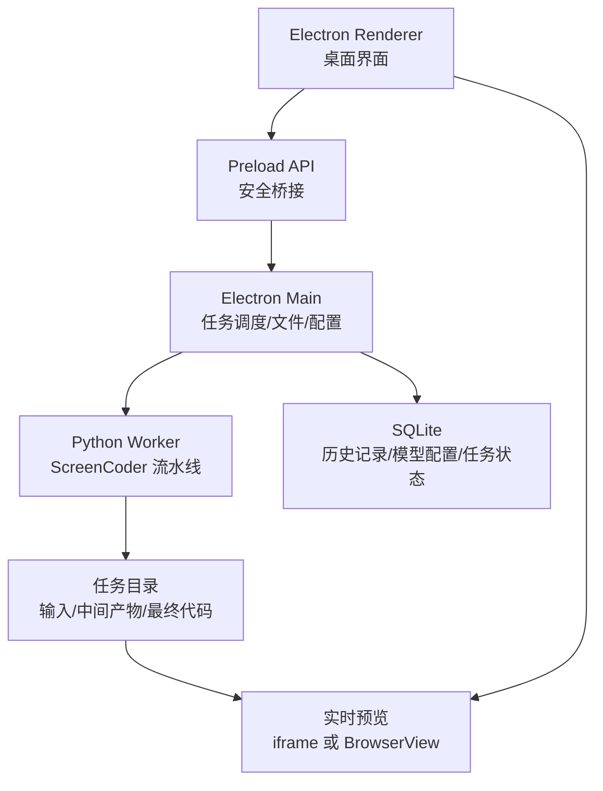
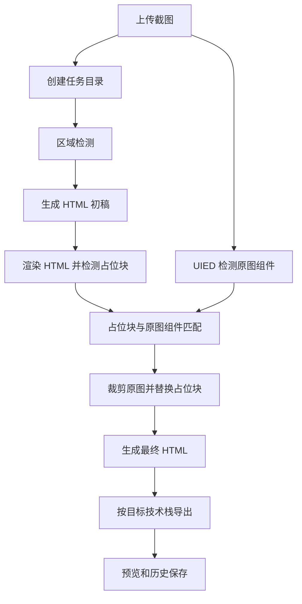

# ScreenCoderDesktop 技术方案

## 1. 目标

ScreenCoderDesktop 的目标是把 ScreenCoder 的截图转代码能力做成桌面端工具。用户可以拖入截图，选择大模型提供商和模型，运行完整流水线，并实时查看中间过程、最终预览和生成代码。

首版目标不是训练模型，也不是重写 ScreenCoder 算法，而是把现有研究型脚本产品化为可配置、可追踪、可恢复的桌面任务系统。

## 2. 可行性结论

可行。推荐架构是 Electron 负责桌面端交互和任务管理，Python Worker 负责运行 ScreenCoder 核心流水线。

不建议把 Python 逻辑直接翻译成 TypeScript，也不建议让 Electron Renderer 直接调用本地文件和模型接口。更稳妥的方式是：

- Renderer 只负责界面。
- Preload 暴露有限 API。
- Main Process 管理文件、配置、任务和子进程。
- Python Worker 运行截图转代码流水线。
- SQLite 保存历史和任务状态。

## 3. 总体架构



## 4. 核心数据流



## 5. 桌面端功能设计

### 5.1 上传与拖拽

支持以下输入方式：

- 拖拽图片到主界面。
- 点击按钮选择图片。
- 从历史任务重新运行。

支持格式：

- PNG
- JPG / JPEG
- WebP

上传后复制到任务目录，不直接修改原文件。

任务目录示例：

```text
workspace/jobs/{jobId}/
  input.png
  config.json
  logs.jsonl
  artifacts/
    layout.html
    final.html
    preview.png
    debug-bboxes.png
    mapping.json
    cropped-images/
```

### 5.2 模型配置

模型配置分为“提供商”和“模型”两类。

提供商配置应支持：

- 提供商名称。
- Base URL。
- API Key。

模型配置应支持：

- 模型名称。
- 所属提供商。
- 模型名。
- 请求超时时间。
- 最大输出 token。
- 是否启用视觉输入。

首批建议支持：

- OpenCode Go
- OpenAI Compatible
- Doubao
- Qwen
- Gemini

配置示例：

```json
{
  "provider": {
    "name": "OpenCode Go",
    "provider": "opencode-go",
    "baseUrl": "https://opencode.ai/zen/go/v1",
    "hasApiKey": true
  },
  "model": {
    "name": "Minimax M3",
    "providerId": "provider-id",
    "model": "minimax-m3"
  }
}
```

API Key 不应明文保存在项目文件中。桌面端使用 Electron `safeStorage` 加密保存，运行时由主进程注入 Worker 环境变量。

### 5.3 页面类型策略

现有 ScreenCoder 默认偏网页截图。桌面端需要显式支持页面类型，否则移动端 App 截图容易识别失败。

建议内置策略：

- Web 页面：`header`、`sidebar`、`navigation`、`main content`
- 移动 App：`status/header`、`service grid`、`feed content`、`bottom nav`
- 自定义模式：用户手动框选区域并命名

首版可以先做 Web 页面和移动 App 两种策略。

### 5.4 流水线运行

Python Worker 提供统一 CLI：

```bash
python -m screencoder_desktop_worker run \
  --input workspace/jobs/{jobId}/input.png \
  --output workspace/jobs/{jobId}/artifacts \
  --provider opencode-go \
  --model minimax-m3 \
  --base-url https://opencode.ai/zen/go/v1 \
  --target html \
  --page-kind web
```

Worker 通过 JSONL 输出进度：

```json
{"type":"stage","stage":"block_detection","status":"running"}
{"type":"artifact","name":"debug-bboxes","path":"artifacts/debug-bboxes.png"}
{"type":"stage","stage":"html_generation","status":"done"}
{"type":"artifact","name":"layout","path":"artifacts/layout.html"}
{"type":"stage","stage":"final","status":"done"}
{"type":"artifact","name":"final","path":"artifacts/final.html"}
```

Electron Main Process 读取 stdout，更新 SQLite 和 UI 状态。

### 5.5 实时预览

实时预览采用分阶段更新：

1. 上传后显示原图。
2. 区域检测后显示 bbox 覆盖图。
3. HTML 初稿生成后显示 `layout.html`。
4. 图片替换后显示 `final.html`。
5. 目标技术栈导出后显示代码文件。

预览方式：

- HTML 输出使用 iframe 或 BrowserView。
- 图片调试产物使用普通图片预览。
- 代码输出使用 Monaco Editor 或轻量代码查看器。

### 5.6 输出目标

内部统一生成 HTML Artifact，再导出不同目标技术栈。

首版导出目标：

- HTML
- Vue 3
- Vue 2
- React

导出层职责：

- HTML：直接输出 `index.html` 和 `assets/`。
- Vue 3：输出 `ScreenCoderPage.vue`，使用 `<template>`、`<script setup>`、`<style scoped>`。
- Vue 2：输出 `ScreenCoderPage.vue`，使用 Options API。
- React：输出 `ScreenCoderPage.tsx` 或 `ScreenCoderPage.jsx`。

建议内部结构：

```ts
interface PageArtifact {
  html: string
  css?: string
  assets: Asset[]
  regions: LayoutRegion[]
  sourceScreenshot: string
}
```

### 5.7 历史管理

使用 SQLite 保存历史。

建议表结构：

```sql
CREATE TABLE jobs (
  id TEXT PRIMARY KEY,
  input_path TEXT NOT NULL,
  output_dir TEXT NOT NULL,
  model_config_id TEXT NOT NULL,
  provider TEXT NOT NULL,
  model TEXT NOT NULL,
  target_framework TEXT NOT NULL,
  page_kind TEXT NOT NULL,
  status TEXT NOT NULL,
  created_at TEXT NOT NULL,
  updated_at TEXT NOT NULL
);

CREATE TABLE artifacts (
  id TEXT PRIMARY KEY,
  job_id TEXT NOT NULL,
  type TEXT NOT NULL,
  path TEXT NOT NULL,
  created_at TEXT NOT NULL
);

CREATE TABLE model_providers (
  id TEXT PRIMARY KEY,
  name TEXT NOT NULL,
  provider TEXT NOT NULL,
  base_url TEXT NOT NULL,
  api_key_ciphertext TEXT,
  created_at TEXT NOT NULL,
  updated_at TEXT NOT NULL
);

CREATE TABLE model_configs (
  id TEXT PRIMARY KEY,
  name TEXT NOT NULL,
  provider_id TEXT NOT NULL,
  model TEXT NOT NULL,
  created_at TEXT NOT NULL,
  updated_at TEXT NOT NULL
);
```

## 6. 代码目录规划

```text
ScreenCoderDesktop/
  apps/
    desktop/
      electron/
        main/
        preload/
        renderer/
  python/
    screencoder_worker/
      providers/
      stages/
      exporters/
      pipeline.py
      cli.py
  docs/
  workspace/
    jobs/
  LICENSE
  NOTICE
```

## 7. Electron 安全策略

Electron 应采用安全默认值：

- `contextIsolation: true`
- `nodeIntegration: false`
- Renderer 不直接访问 Node.js
- 通过 preload 暴露白名单 API
- 文件选择、任务运行、配置保存都由 Main Process 处理
- 不在 Renderer 中保存 API Key

参考文档：

- https://electronjs.org/docs/latest/tutorial/ipc
- https://electronjs.org/docs/latest/tutorial/context-isolation
- https://electronjs.org/docs/latest/tutorial/security

## 8. Python Worker 改造点

需要把当前 ScreenCoder 脚本从固定路径改成参数化模块：

- 输入文件路径参数化。
- 输出目录参数化。
- 模型配置参数化。
- 中间文件命名按任务隔离。
- 每个阶段输出结构化日志。
- 每个阶段可单独重试。
- 支持失败时保留调试产物。

当前需要重点修正的问题：

- `data/input/test1.png` 写死。
- `data/tmp/test1_bboxes.json` 被多个阶段复用。
- 网页截图和移动端截图共用同一套区域提示词。
- 模型返回格式不稳定时缺少严格校验。
- Tailwind 版本和模型生成类名可能不兼容。

## 9. MVP 范围

第一阶段建议只做最小可用桌面版：

1. 创建 Electron 桌面壳。
2. 支持拖拽上传单张截图。
3. 支持配置 OpenCode Go 模型。
4. 支持运行 HTML 目标流水线。
5. 支持日志流和阶段状态。
6. 支持最终 HTML 预览。
7. 支持历史列表和重新打开结果。

暂缓：

- 批量处理。
- 手动框选区域。
- Vue/React 高质量重构。
- 模型市场。
- 云同步。

## 10. 第二阶段

第二阶段增加：

- Vue 2、Vue 3、React 导出。
- Web / 移动 App 页面类型选择。
- 区域框可视化调整。
- 任务取消和重试。
- 导出 zip。
- 第三方依赖许可证清单。

## 11. 风险与对策

| 风险 | 影响 | 对策 |
| --- | --- | --- |
| 模型输出不稳定 | 页面结构错误 | 使用结构化提示词、JSON schema 校验、失败重试 |
| 移动端截图识别失败 | 流水线中断 | 增加页面类型策略和手动框选 |
| Python 依赖重 | 安装和打包复杂 | Worker 独立环境，桌面端检测环境状态 |
| Playwright 浏览器下载慢 | 首次运行失败 | 优先使用系统 Chrome，必要时内置浏览器 |
| API Key 泄露 | 安全风险 | 使用系统安全存储，不写入仓库 |
| Apache 合规遗漏 | 法务风险 | 保留 LICENSE/NOTICE，建立第三方许可证清单 |

## 12. 推荐实施顺序

1. 建立干净 Electron 仓库和文档。
2. 把 ScreenCoder 流水线封装成参数化 Python CLI。
3. Electron Main Process 调通 Python Worker。
4. Renderer 实现上传、配置、运行、日志、预览。
5. 加入 SQLite 历史管理。
6. 做 HTML 导出闭环。
7. 再做 Vue/React 导出。

## 13. 验收标准

MVP 完成时应满足：

- 用户可以拖入一张截图。
- 用户可以选择模型配置。
- 点击运行后可以看到阶段进度和日志。
- 失败时能看到失败阶段和错误信息。
- 成功后能在桌面端预览最终 HTML。
- 历史记录中能重新打开该任务。
- 仓库包含 Apache License 2.0、NOTICE 和合规说明。
